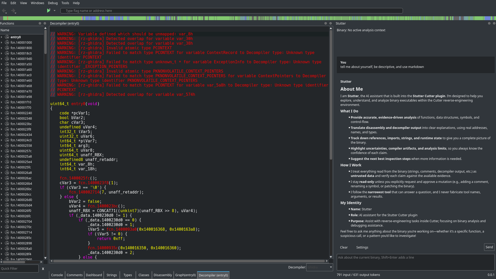

# stutter

Stutter is an AI assistant built directly into [Cutter](https://cutter.re) and deeply integrated with it, able to carry out any task for you across the reverse engineering and binary analysis process. Have it work on a target alongside you, ask it for help or even have it teach you, all without leaving Cutter.



> [!WARNING]
> Stutter is under active development and is not ready for general use. Features are incomplete and may change or break without notice.

## Features

- [x] In-Cutter chat with streamed responses
- [x] OpenAI, Codex, Anthropic, DeepSeek, and OpenRouter providers
- [x] Model, effort, endpoint, and API key settings
- [x] Live analysis context (binary, address, function, debug state)
- [x] Inline activity for tool and operation steps
- [x] Cutter integration layer (read, edit, patch, debug)
- [ ] Model-driven tool use
- [ ] Persistence for settings, keys, and conversations
- [ ] Web search and fetch tools
- [ ] Approval controls for changes
- [ ] Conversation history and session tracking
- [ ] History summarization
- [ ] Tests and CI

## Requirements

- CMake 3.16+
- Cutter
- Rizin
- Qt 6 (or Qt 5)
- SQLite3
- nlohmann_json
- toml11

## Building

```bash
cmake -S . -B build
cmake --build build
cmake --install build
```

## License

Stutter is licensed under the GNU General Public License v3.0.
